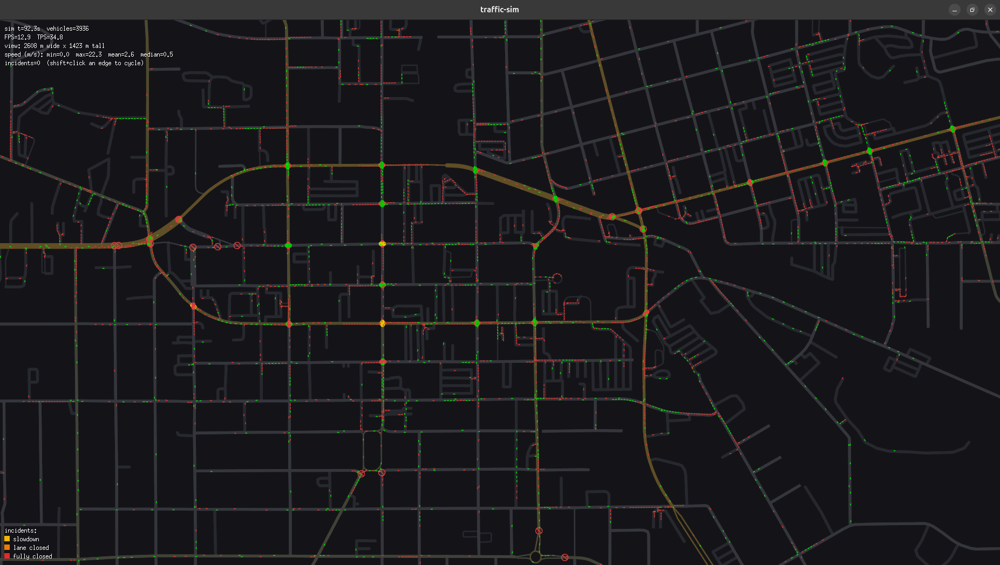

# traffic-sim



Go-based traffic simulator that reads OpenStreetMap files and runs a
city-scale microsimulation. Vehicles use the Intelligent Driver Model
(IDM) for car-following, change lanes when beneficial, and obey
auto-generated fixed-time traffic signals (overridable via YAML).

Output: a live Ebitengine viewer (pan/zoom, vehicles, signals, HUD)
and an optional binary trace file for replay or offline analysis.

## Install

Recommended — install the binaries directly from GitHub with `go install`:

```
go install github.com/lab1702/traffic-sim/cmd/trafficsim@latest
go install github.com/lab1702/traffic-sim/cmd/tracereplay@latest
```

This drops `trafficsim` and `tracereplay` into `$(go env GOBIN)` (or
`$(go env GOPATH)/bin` if `GOBIN` is unset). Add that directory to your
`PATH` to invoke them by name.

Pin a specific version by replacing `@latest` with a tag (e.g. `@v0.1.0`)
or commit SHA.

## Build from source

If you've cloned the repo and want to build locally:

```
go build ./cmd/trafficsim/
go build ./cmd/tracereplay/
```

This drops `trafficsim` and `tracereplay` (`.exe` on Windows) into the
current directory. Either prefix with `./` to run them, or `go install
./...` to put them on `PATH`. Examples below assume one of those.

## Run

Load and inspect a graph:
```
./trafficsim load extract.osm.pbf
```

Run with the viewer:
```
./trafficsim run --spawn-rate 20 --trace run.trace extract.osm.pbf
```

> Flags must appear BEFORE the OSM path — the Go flag parser stops at
> the first non-flag argument.

Run headless (research mode):
```
./trafficsim run --headless --duration 5m --spawn-rate 20 --trace run.trace extract.osm.pbf
```

> Ctrl+C (SIGINT/SIGTERM) triggers an orderly shutdown: the trace is
> flushed with a final `SimEnd` event before the process exits.

Replay a trace:
```
./tracereplay -osm extract.osm.pbf -trace run.trace
./tracereplay -speed 4 -osm extract.osm.pbf -trace run.trace   # 4x playback
```

Signal overrides (per intersection):
```
./trafficsim run --signals configs/signals.example.yaml extract.osm.pbf
```

The YAML schema is documented inline in `configs/signals.example.yaml`.
A missing or invalid signals file causes `trafficsim` to exit with a
clear error rather than silently producing zero overrides.

### Actuated signals

Auto-generated signals are **semi-actuated**, not fixed-time. At each
multi-leg intersection the higher-class axis (the arterial) is the *major*
phase and rests in green; the side-street *minor* phases are served only on
demand. A vehicle within a detection zone of the stop line places a call;
the controller switches to that phase after the major street has had its
minimum green, holds it for a minimum green, extends it while vehicles keep
arriving (passage/gap-out), and caps it at a maximum green so a busy side
street can't starve the arterial. With no side-street traffic the arterial
holds green indefinitely instead of cycling to an empty approach.

This is the default for every auto-generated signal. A `--signals` override
pins an intersection to an explicit **fixed-time** plan (the override schema
is unchanged). Actuation is deterministic — detection is a pure function of
vehicle positions — so the `--seed` trace-determinism guarantee still holds.
Single-leg signals stay a permanent green (nothing to actuate).

### GPS rerouting

By default every vehicle has GPS and re-routes around congestion. Each edge
tracks the smoothed average speed of the vehicles on it, which feeds a
travel-time routing cost; when a vehicle enters a new edge it re-evaluates the
remaining path to its destination and switches to a meaningfully faster route
if one exists. Tune the share of GPS-equipped vehicles with `--gps-share`
(0..1, default 1.0):

```
./trafficsim run --gps-share 0.5 --spawn-rate 20 extract.osm.pbf   # half the fleet
./trafficsim run --gps-share 0 --spawn-rate 20 extract.osm.pbf     # static routing
```

Reroutes are recorded in the trace as `VehicleReroute` events, so `tracereplay`
follows the path each vehicle actually took.

### Incidents (interactive)

In the live viewer you can inject road incidents on the fly. **Shift + left-click
an edge** to cycle its incident severity:

`none → slowdown → lane closed → fully closed → none`

On a two-way road the incident applies to both directions, so a closed road is
closed both ways.

- **Slowdown** — traffic crawls through the edge (desired speed capped).
- **Lane closed** — the curb lane is blocked; vehicles merge out of it.
- **Fully closed** — every lane is blocked. GPS-equipped vehicles reroute around
  it (diverting promptly, even mid-approach); vehicles with no alternative — and
  vehicles without GPS — queue at the entrance until it reopens.

Incidents stay until you clear them (cycle back to `none`). The active count is
shown in the HUD, with a color legend (bottom-left) for the overlay colors.
Shift+clicking an edge also selects it: the edge is highlighted and a panel shows
its current incident level. Each change is written to the trace as an
`IncidentSet` event, so `tracereplay` shows incidents appearing and clearing at
the same moments they did live.

Incidents are a viewer-only (interactive) feature; `--headless` runs have none.
A fully-closed edge that a non-GPS vehicle is already committed to will queue it
until the existing stuck-vehicle timeout clears it.

### Notes for Windows

- Built binaries end in `.exe`. The commands above work in PowerShell
  exactly as shown (`./trafficsim.exe` is also accepted).
- `go install ./...` places binaries in `%USERPROFILE%\go\bin` by default.
- Paths with spaces must be double-quoted.

## Determinism

Same `--seed` + same OSM + same `--spawn-rate` → byte-identical trace.
This is verified by `TestWorld_TraceDeterminism`.

## Performance

Tick budget is 50 ms at 20 Hz. Baseline per-tick benchmarks on a 40x40 grid
(1,600 intersections, ~6,240 directed edges) with static routing (pre-GPS),
measured on Intel Core Ultra 9 285K:

| Vehicles | ns/op     | ms/tick |
|----------|-----------|---------|
| 1,000    | 460,402   | 0.46    |
| 5,000    | 1,966,688 | 1.97    |
| 10,000   | 3,023,438 | 3.02    |

All three are well under the 50 ms budget, leaving headroom for real-world
network complexity and additional features.

### GPS rerouting overhead

GPS rerouting (on by default) adds two per-tick costs: an always-on congestion
update (O(edges)) and, for each vehicle that has just crossed into a new edge and
is past its reroute cooldown, a shortest-path recomputation. Comparing
`--gps-share 0` (static routing) against `--gps-share 1` (every vehicle) on the
same 40x40 grid (AMD Ryzen AI 9 HX 370, median of 3 runs):

| Vehicles | `--gps-share 0` | `--gps-share 1` | Rerouting overhead |
|----------|-----------------|-----------------|--------------------|
| 1,000    | ~0.6 ms/tick    | ~1.7 ms/tick    | +1.1 ms (~2.8x)    |
| 5,000    | ~2.4 ms/tick    | ~6.7 ms/tick    | +4.3 ms (~2.8x)    |
| 10,000   | ~3.6 ms/tick    | ~3.4 ms/tick    | ~0 (gridlock)      |

The overhead is workload-dependent, not a fixed multiplier. Reroutes trigger on
edge entry, so under heavy gridlock (10k) vehicles rarely cross edges and the A*
recomputations seldom fire — GPS cost falls to near zero. The peak is at
moderate-but-congested load (5k). Every case stays well within the 50 ms budget.

`--gps-share 0` still pays the always-on congestion update, so the delta above
isolates the rerouting/A* work specifically rather than the full feature cost.
The two tables were measured on different hardware (don't compare them directly),
and per-run variance is roughly 10–20%.

Run benchmarks yourself:
```
go test ./internal/sim/ -bench=. -benchtime=2s -run=^$
```

## E2E testing

To run the full pipeline against a real OSM extract:
```
TRAFFIC_SIM_E2E_OSM=path/to/extract.osm.pbf go test -tags e2e ./internal/e2e/
```

Recommended small extract: a single neighborhood from https://extract.bbbike.org (5–20 MB .osm.pbf).

## Design + plan

- Spec: `docs/superpowers/specs/2026-05-15-traffic-sim-design.md`
- Plan: `docs/superpowers/plans/2026-05-15-traffic-sim.md`
